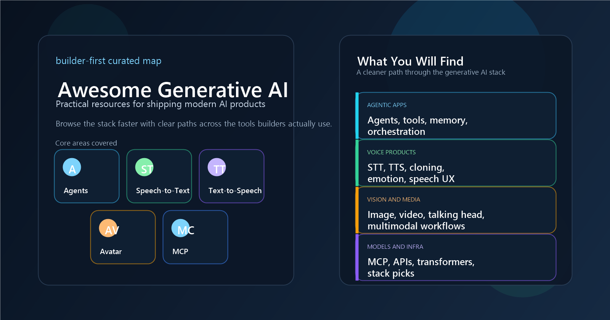

  

<h1 align="center">🚀 Awesome Generative AI Resources</h1>

  <strong>Comprehensive collection of cutting-edge Generative AI resources across Speech, Text, Image, and Multimodal domains</strong>

<!-- Badges -->

  
  
  
  
  

  <a href="#-main-categories">📚 Categories</a> •
  <a href="#-transformers--foundation-models">🤖 Models</a> •
  <a href="#-super-agents">🦾 Agents</a> •
  <a href="#-contribution">💡 Contribute</a>

---

## 🎯 **About This Repository**

This is a **curated and organized collection** of state-of-the-art Generative AI resources, carefully compiled from various open-source projects, research papers, and community contributions. Each resource has been selected for its quality, relevance, and practical utility in the AI/ML ecosystem.

### 🌟 **What You'll Find Here:**
- **Speech Processing**: STT, TTS, Voice Cloning, Emotion Recognition
- **Computer Vision**: Text-to-Image, Talking Head Generation
- **Multimodal AI**: Transformers, Foundation Models, APIs
- **AI Agents**: Latest autonomous AI systems and frameworks
- **Datasets**: High-quality training data for various AI tasks

---

## 📚 **Main Categories**

| 🎙️ **Speech** | 🖼️ **Vision** | 🤖 **AI & APIs** | 📊 **Data** |
|:---:|:---:|:---:|:---:|
| [STT Datasets](./stt-datasets.md) | [Text-to-Image](./text-to-image.md) | [GenAI APIs](./genai-apis.md) | [STT Models](./stt-models.md) |
| [STT Models](./stt-models.md) | [Talking Head](./talking-head.md) | [Transformers](./transformers.md) | [TTS Models](./tts.md) |
| [TTS Models](./tts.md) | | | [Voice Cloning](./voice-cloning.md) |
| [Voice Cloning](./voice-cloning.md) | | | [Emotion Recognition](./emotion-recognition.md) |
| [Emotion Recognition](./emotion-recognition.md) | | | |

---

## 🤖 **Transformers & Foundation Models**

### 🎵 **Audio Processing**
- **Whisper** - Multilingual speech recognition
- **Moonshine** - Automatic speech recognition
- **Wav2Vec2** - Keyword spotting
- **Moshi** - Speech-to-speech generation
- **MusicGen** - Text-to-audio generation
- **Bark** - Text-to-speech synthesis

### 👁️ **Computer Vision**
- **SAM** - Automatic mask generation
- **DepthPro** - Depth estimation
- **DINO v2** - Image classification
- **SuperGlue** - Keypoint detection & matching
- **RT-DETRv2** - Object detection
- **VitPose** - Pose estimation
- **OneFormer** - Universal segmentation
- **VideoMAE** - Video classification

### 🔄 **Multimodal**
- **Qwen2-Audio** - Audio/text to text
- **LayoutLMv3** - Document understanding
- **Qwen-VL** - Image/text to text
- **BLIP-2** - Image captioning
- **GOT-OCR2** - OCR document understanding
- **TAPAS** - Table question answering
- **Emu3** - Unified multimodal understanding
- **Llava** - Visual question answering
- **Kosmos-2** - Visual referring expression

### 📝 **Natural Language Processing**
- **ModernBERT** - Masked word completion
- **Gemma** - Named entity recognition
- **Mixtral** - Question answering
- **BART** - Summarization
- **T5** - Translation
- **Llama** - Text generation
- **Qwen** - Text classification

---

## 🦾 **Super Agents**

| Agent | Organization | Description | Links |
|:---|:---|:---|:---|
| **DeepResearchAgent** | Skywork AI | Hierarchical multi-agent framework | [Repo](https://github.com/SkyworkAI/DeepResearchAgent) • [Paper](https://arxiv.org/abs/2025.06.14) |
| **OWL** | CAMEL-AI.org | Optimized Workforce Learning | [Repo](https://github.com/camel-ai/owl) • [Paper](https://arxiv.org/abs/2025.05.29) |
| **Suna** | Kortix | Open-source generalist AI agent | [Repo](https://github.com/kortix/suna) • [Release](https://kortix.ai/suna) |
| **OpenManus** | MetaGPT | Open alternative to Manus | [Repo](https://github.com/metagpt/openmanus) • [Release](https://metagpt.ai/openmanus) |
| **Agent S²** | Simular | Compositional generalist-specialist framework | [Repo](https://github.com/simular/agent-s2) • [Paper](https://arxiv.org/abs/2025.04.01) |
| **UI-TARS** | ByteDance | All-in-one multimodal AI agent stack | [Repo](https://github.com/bytedance/ui-tars) • [Paper](https://arxiv.org/abs/2025.01.21) |

---

## 📖 **Detailed Resources**

- **[🧩 Comprehensive Open-Source Projects](./more_detailed.md)** - Extended collection with detailed descriptions and implementation guides

---

## 💡 **Contribution**

Found something amazing that should be here? We'd love to include it!

### 🤝 **How to Contribute:**
1. **Open an Issue** - Suggest new resources or improvements
2. **Submit a PR** - Add new content or fix existing entries
3. **Share Feedback** - Help us improve the organization and structure

### 📋 **Guidelines:**
- Ensure resources are open-source or freely accessible
- Include relevant links (GitHub, papers, demos)
- Provide brief but informative descriptions
- Maintain consistent formatting

---

## ⚖️ **Disclaimer**

This repository is a **curated collection** of Generative AI and LLM-related projects. All rights and credits belong to their respective authors and organizations. If you're an author and would like to suggest edits or request removal, please [open an issue](https://github.com/Mrkomiljon/awesome-generative-ai/issues).

---

**⭐ Star this repo if you find it helpful!**

**🔄 Updated regularly with the latest AI breakthroughs**

