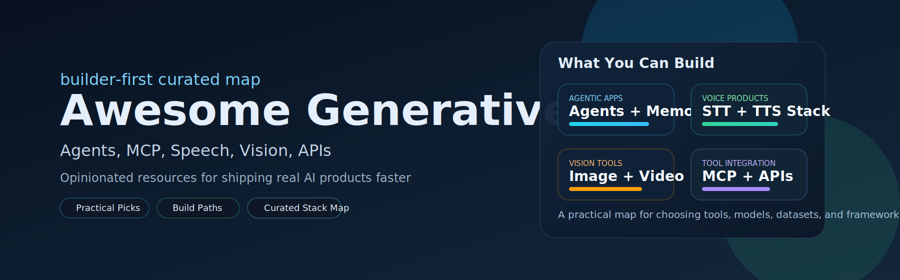

  

<h1 align="center">Awesome Generative AI Resources</h1>

  <strong>Comprehensive collection of cutting-edge Generative AI resources across Speech, Text, Image, and Multimodal domains</strong>

<!-- Badges -->

  
  
  
  
  

  <a href="#start-here">Start Here</a> |
  <a href="#main-categories">Categories</a> |
  <a href="#transformers--foundation-models">Models</a> |
  <a href="#ai-agents--frameworks">Agents</a> |
  <a href="#contribution">Contribute</a>

---

## Start Here

- New here? Pick a track below and dive in.
- Top picks: [AI Agents](./ai-agents.md), [TTS Models](./tts.md), [Talking Head](./talking-head.md), [MCP Servers](./mcp.md)
- Popular links: [Transformers](./transformers.md), [GenAI APIs](./genai-apis.md), [STT Models](./stt-models.md), [Text-to-Image](./text-to-image.md)

---

## About This Repository

This is a curated and organized collection of state-of-the-art Generative AI resources, compiled from open-source projects, research papers, and community contributions. Each resource is selected for quality, relevance, and practical value.

### What You'll Find Here
- Speech Processing: STT, TTS, Voice Cloning, Emotion Recognition
- Computer Vision: Text-to-Image, Talking Head Generation
- Multimodal AI: Transformers, Foundation Models, APIs
- AI Agents: Autonomous systems and frameworks
- MCP Servers: Model Context Protocol servers for tool integration
- Datasets: High-quality training data for AI tasks

### Featured: Talking Head Generation

Highlights:
- 500+ research papers (2016-2025)
- Latest models: VASA-1, EMO, AniPortrait, GaussianTalker
- 3D tech: NeRF, Gaussian Splatting, FLAME
- Datasets: VoxCeleb, MEAD, HDTF, Multiface
- Real-time tools: Wav2Lip, SadTalker, LivePortrait

Top 5 models:
- VASA-1 - Microsoft's lifelike real-time talking faces
- EMO - Expressive portrait videos with diffusion
- AniPortrait - Photorealistic portrait animation
- GaussianTalker - 3D Gaussian splatting for talking heads
- LivePortrait - Real-time portrait animation

Full list: [Talking Head](./talking-head.md)

---

## Main Categories

| Speech | Vision | AI and APIs | Data | MCP |
|:---:|:---:|:---:|:---:|:---:|
| [STT Datasets](./stt-datasets.md) | [Text-to-Image](./text-to-image.md) | [GenAI APIs](./genai-apis.md) | [STT Models](./stt-models.md) | [MCP Servers](./mcp.md) |
| [STT Models](./stt-models.md) | [Talking Head](./talking-head.md) | [Transformers](./transformers.md) | [TTS Models](./tts.md) | |
| [TTS Models](./tts.md) | | | [Voice Cloning](./voice-cloning.md) | |
| [Voice Cloning](./voice-cloning.md) | | | [Emotion Recognition](./emotion-recognition.md) | |
| [Emotion Recognition](./emotion-recognition.md) | | | | |

---

## AI Agents and Frameworks

Top 5 agents:
- AutoGPT - Accessible tools for building and using AI agents
- AutoGen - Multi-agent conversation framework for LLM apps
- CrewAI - Role-playing agent orchestration framework
- SuperAGI - Open-source framework for autonomous agents
- GPT Researcher - Autonomous agent for online research

Full list: [AI Agents](./ai-agents.md)

---

## Transformers and Foundation Models

### Audio Processing (Top 5)
- Whisper - Multilingual speech recognition
- Moonshine - Automatic speech recognition
- Wav2Vec2 - Keyword spotting
- MusicGen - Text-to-audio generation
- Bark - Text-to-speech synthesis

Full list: [Transformers](./transformers.md)

### Computer Vision (Top 5)
- SAM - Automatic mask generation
- DINO v2 - Image classification
- RT-DETRv2 - Object detection
- VitPose - Pose estimation
- OneFormer - Universal segmentation

Full list: [Transformers](./transformers.md)

### Talking Head Generation (Top 5)
- VASA-1 - Real-time talking faces
- EMO - Expressive portrait video generation
- AniPortrait - Photorealistic portrait animation
- GaussianTalker - 3D Gaussian splatting for talking heads
- Wav2Lip - Lip-sync expert for speech-driven animation

Full list: [Talking Head](./talking-head.md)

### Multimodal (Top 5)
- Qwen2-Audio - Audio and text to text
- Qwen-VL - Image and text to text
- BLIP-2 - Image captioning
- GOT-OCR2 - OCR document understanding
- Llava - Visual question answering

Full list: [Transformers](./transformers.md)

### Natural Language Processing (Top 5)
- ModernBERT - Masked word completion
- Gemma - Named entity recognition
- Mixtral - Question answering
- BART - Summarization
- T5 - Translation

Full list: [Transformers](./transformers.md)

---

## Model Context Protocol (MCP) Servers

Top 5 MCP servers:
- Browserbase MCP - Cloud browser automation
- Microsoft Playwright MCP - Official browser automation
- Supabase MCP - Database and backend integration
- Pipedream MCP - API integration platform
- Redis MCP - In-memory database integration

Full list: [MCP Servers](./mcp.md)

Key categories:
- Browser Automation: Web scraping, form filling, navigation
- Database Integration: PostgreSQL, MongoDB, Redis, SQLite
- Cloud Platforms: AWS, Cloudflare, Kubernetes management
- Communication: Slack, Discord, Telegram, Teams integration
- Developer Tools: GitHub, Docker, CI/CD, API testing

MCP statistics:
- 500+ MCP servers across all categories
- 20+ programming languages supported
- Cross-platform support (Windows, macOS, Linux)
- Production-ready servers for enterprise use

---

## Detailed Resources

- [Comprehensive Open-Source Projects](./more_detailed.md) - Extended collection with detailed descriptions and implementation guides

---

## Contribution

Found something amazing that should be here? We would love to include it.

### How to Contribute
1. Open an Issue - Suggest new resources or improvements
2. Submit a PR - Add new content or fix existing entries
3. Share Feedback - Help us improve the organization and structure

### Guidelines
- Ensure resources are open-source or freely accessible
- Include relevant links (GitHub, papers, demos)
- Provide brief but informative descriptions
- Maintain consistent formatting

---

## Disclaimer

This repository is a curated collection of Generative AI and LLM-related projects. All rights and credits belong to their respective authors and organizations. If you are an author and would like to suggest edits or request removal, please open an issue.

---

**Star this repo if you find it helpful!**

**Updated regularly with the latest AI breakthroughs**

