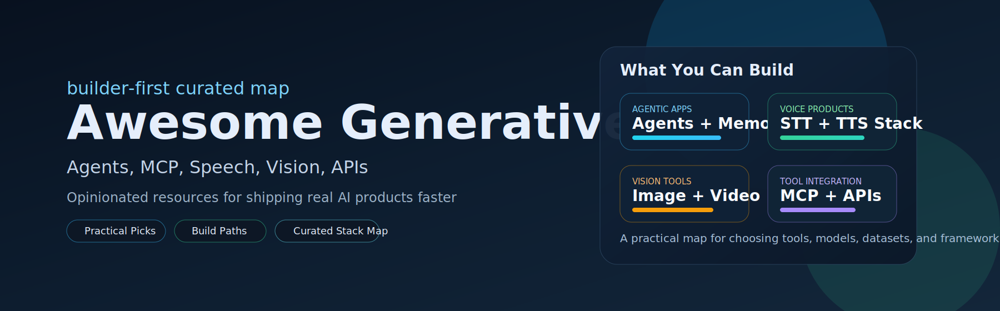

  

<h1 align="center">Awesome Generative AI Resources</h1>

  <strong>An opinionated, builder-first map of the generative AI stack</strong>

  <a href="#why-this-list">Why This List</a> |
  <a href="#start-here">Start Here</a> |
  <a href="#top-picks">Top Picks</a> |
  <a href="#build-paths">Build Paths</a> |
  <a href="#resource-index">Resource Index</a> |
  <a href="#contributing">Contributing</a>

---

## Why This List

Most AI awesome lists are too broad, too stale, or too academic.

This repo is for builders who want to ship real products with modern generative AI:

- Practical entry points across agents, MCP, speech, vision, and model APIs
- Curated links that are useful for implementation, not just hype
- Faster path selection instead of endless scrolling through generic lists

If you are building agentic apps, voice products, multimodal workflows, or AI-powered developer tools, start here.

---

## Start Here

Pick one path and get moving in under 10 minutes:

- Build AI agents: [AI Agents](./docs/ai-agents.md)
- Build speech products: [STT Models](./docs/stt-models.md), [TTS Models](./docs/tts.md)
- Build visual products: [Text-to-Image](./docs/text-to-image.md), [Talking Head](./docs/talking-head.md)
- Build model apps: [Transformers](./docs/transformers.md), [GenAI APIs](./docs/genai-apis.md)
- Add tool integration: [MCP Servers](./docs/mcp.md)

---

## Top Picks

If you only open a few sections, start with these:

| Area | Best Starting Point | Why It Matters |
|:---|:---|:---|
| Agentic apps | [AI Agents](./docs/ai-agents.md) | Frameworks, coding agents, memory systems, and orchestration tools |
| Tool-using LLMs | [MCP Servers](./docs/mcp.md) | Quick map of the MCP ecosystem and the most useful server categories |
| Voice AI | [TTS Models](./docs/tts.md), [STT Models](./docs/stt-models.md) | Core stack for assistants, call automation, and speech UX |
| Visual generation | [Text-to-Image](./docs/text-to-image.md), [Talking Head](./docs/talking-head.md) | Useful for multimodal products, synthetic media, and creator tools |
| Model integration | [GenAI APIs](./docs/genai-apis.md), [Transformers](./docs/transformers.md) | Compare hosted APIs and open model tooling quickly |

---

## Build Paths

### 1. Agentic Apps
- Start: [AI Agents](./docs/ai-agents.md)
- Add memory and context: [context-engineering.md](./docs/context-engineering.md)
- Add tool integration: [mcp.md](./docs/mcp.md)
- Best for: coding agents, assistants, workflow automation, and multi-agent systems

### 2. Voice and Audio Products
- Speech recognition: [stt-models.md](./docs/stt-models.md), [stt-datasets.md](./docs/stt-datasets.md)
- Speech synthesis: [tts.md](./docs/tts.md), [voice-cloning.md](./docs/voice-cloning.md)
- Emotion and affect: [emotion-recognition.md](./docs/emotion-recognition.md)
- Best for: call agents, speech interfaces, dubbing, and voice cloning pipelines

### 3. Vision and Video Products
- Image generation: [text-to-image.md](./docs/text-to-image.md)
- Talking avatars: [talking-head.md](./docs/talking-head.md)
- Best for: creative tools, avatars, media generation, and synthetic presenters

### 4. Foundation Model Productization
- Model selection: [transformers.md](./docs/transformers.md)
- API integrations: [genai-apis.md](./docs/genai-apis.md)
- Best for: choosing between open-source models, APIs, and deployment approaches

---

## Resource Index

| Area | Primary Files |
|:---|:---|
| Agents and orchestration | [ai-agents.md](./docs/ai-agents.md), [mcp.md](./docs/mcp.md), [context-engineering.md](./docs/context-engineering.md) |
| Speech | [stt-models.md](./docs/stt-models.md), [stt-datasets.md](./docs/stt-datasets.md), [tts.md](./docs/tts.md), [voice-cloning.md](./docs/voice-cloning.md), [emotion-recognition.md](./docs/emotion-recognition.md) |
| Vision and media | [text-to-image.md](./docs/text-to-image.md), [talking-head.md](./docs/talking-head.md) |
| Models and APIs | [transformers.md](./docs/transformers.md), [genai-apis.md](./docs/genai-apis.md) |
| Extended references | [more_detailed.md](./docs/more_detailed.md) |

---

## Quality Notes

- Curated manually for practical relevance and builder usefulness
- Focused on tools, repos, datasets, and frameworks with real implementation value
- Some files include star counts from periodic updates
- If you spot stale entries, weak categorization, or broken links, open an issue or PR

---

## Contributing

Contributions are welcome for:

- New high-quality open-source repos
- Broken links or outdated entries
- Better categorization and structure

Please follow [CONTRIBUTING.md](./CONTRIBUTING.md).

---

## Disclaimer

This is a curated collection of external resources. Rights and credit belong to each original author and organization.

